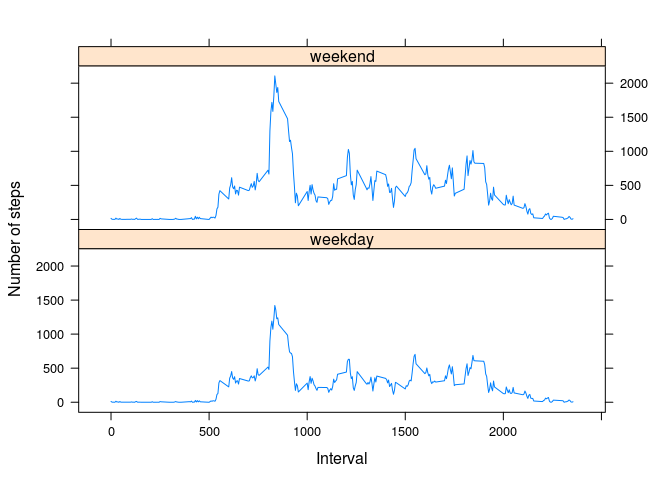

# Reproducible Research: Peer Assessment 1


## Loading and preprocessing the data
Download and unzip the file if not already done, then read in the file.

```r
if(!file.exists("activity.csv")) {
  download.file("https://d396qusza40orc.cloudfront.net/repdata%2Fdata%2Factivity.zip","activity.zip",method="curl")
  unzip("activity.zip")
}
activity <- read.csv("activity.csv")
```

## What is mean total number of steps taken per day?
Calculate the total number of steps taken each day.

```r
library(dplyr)
```

```
## 
## Attaching package: 'dplyr'
## 
## The following object is masked from 'package:stats':
## 
##     filter
## 
## The following objects are masked from 'package:base':
## 
##     intersect, setdiff, setequal, union
```

```r
activity <- tbl_df(activity)
byDate <- summarise(group_by(activity, date), summed = sum(steps, na.rm=TRUE))
```

Here we plot the histogram of the total number of steps taken each day, and compute the mean and median for comparison with filling the ```NA```s with other values in a later part of this project.

```r
hist(activity$steps, main="Histogram of total number of steps taken each day", xlab="Steps")
```

 

```r
meanBefore <- mean(byDate$summed)
medianBefore <- median(byDate$summed)
```

The mean total number of steps taken each day is 9354.2295082.  
The median total number of steps taken each day is 10395.

## What is the average daily activity pattern?
Plot the average number of steps taken in each 5-minute interval across all days.

```r
byInterval <- summarise(group_by(activity, interval), steps = mean(sum(steps, na.rm=TRUE)))
with(byInterval,plot(interval,steps,type='l'))
```

 

The 5-minute interval on average across all the days in the dataset which contains the maximum number of steps is 1.0927\times 10^{4}.

## Imputing missing values
The number of rows with ```NA```s is ```sum(is.na(activity$steps))```.

We fill in all the missing values with the mean for that 5-minute interval.

```r
activity$steps[is.na(activity$steps)] <- inner_join(activity[is.na(activity$steps),c("interval","date")], byInterval, by="interval")$steps
```

Histogram of total number of steps taken each day.

```r
byDate <- summarise(group_by(activity, date), summed = sum(steps, na.rm=TRUE))
hist(activity$steps, main="Histogram of total number of steps taken each day", xlab="Steps")
```

 

We recompute the mean and median and compare them to the values in the first part of the assignment.

```r
meanAfter <- mean(byDate$summed)
medianAfter <- median(byDate$summed)
```
The mean total number of steps taken each day is 8.4188066\times 10^{4}.
The median total number of steps taken each day is 1.1458\times 10^{4}.  
The mean and median have increased considerably due to filling up missing intervals with positive values.


## Are there differences in activity patterns between weekdays and weekends?
Create a new factor variable in the dataset with two levels – “weekday” and “weekend” indicating whether a given date is a weekday or weekend day.

```r
library(lubridate)
activity <- mutate(activity, dayType=wday(ymd(date)))
activity$dayType[activity$dayType %in% 1:5] = "weekday"
activity$dayType[activity$dayType %in% 6:7] = "weekend"
```

Make a panel plot containing a time series plot (i.e. ```type = "l"```) of the 5-minute interval (x-axis) and the average number of steps taken, averaged across all weekday days or weekend days (y-axis).

```r
library(lattice)
stepsByDayType <- summarise(group_by(activity, interval, dayType), steps=mean(steps))
xyplot(steps ~ interval | dayType, stepsByDayType, layout=c(1,2), type='l', xlab="Interval", ylab="Number of steps")
```

 

The trend is that there are more steps taken during the weekend than on weekdays. A weakness of this analysis is that the missing interval had been filled with averages across all intervals, causing cross-contamination between weekday and weekend data.
